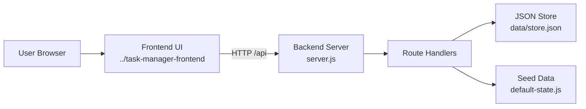

# SoumyaFlow Backend

Professional task manager backend API for the company workspace. This backend serves the frontend, exposes task and HR-style APIs, and persists data in a local JSON store.

## Overview

This backend is designed to work with the sibling frontend folder:

- Frontend path: `../task-manager-frontend`
- Local app URL: `http://localhost:3000`

The backend serves static frontend files and handles API routes for authentication, tasks, attendance, leave, notifications, security settings, and announcements.

## Features

- serves the frontend application
- exposes REST-style API routes
- stores state in `data/store.json`
- seeds data from `default-state.js`
- no external dependencies required

## Tech Stack

- Node.js
- built-in `http`, `fs`, `path`, and `url` modules

## Project Structure

```text
task-manager-backend/
|-- server.js
|-- default-state.js
|-- package.json
|-- README.md
`-- data/
    `-- store.json
```

## Run

```powershell
cd C:\Users\PRANATI\OneDrive\Documents\Playground\task-manager-backend
node server.js
```

Open:

- `http://localhost:3000`

## AWS Deployment

- Elastic Beanstalk, EC2, or ECS/App Runner are all reasonable starting points
- Deployment notes are in `DEPLOY_AWS.md`

## Architecture Diagram



## Important Files

- `server.js`: API routes, static file serving, JSON responses
- `default-state.js`: seed data used to initialize the store
- `data/store.json`: current persisted runtime data

## Example API Areas

- `GET /api/state`
- `POST /api/reset`
- `POST /api/auth/login`
- `POST /api/auth/logout`
- `POST /api/tasks`
- `PATCH /api/tasks/:id/status`
- `POST /api/attendance`
- `POST /api/work-logs`
- `POST /api/leaves`
- `PATCH /api/leaves/:id/status`
- `POST /api/security`
- `POST /api/announcements`

## Git Notes

- Commit this folder as the backend application
- Ignore runtime log files if you add them later
- Keep `store.json` only if you want demo data changes versioned
